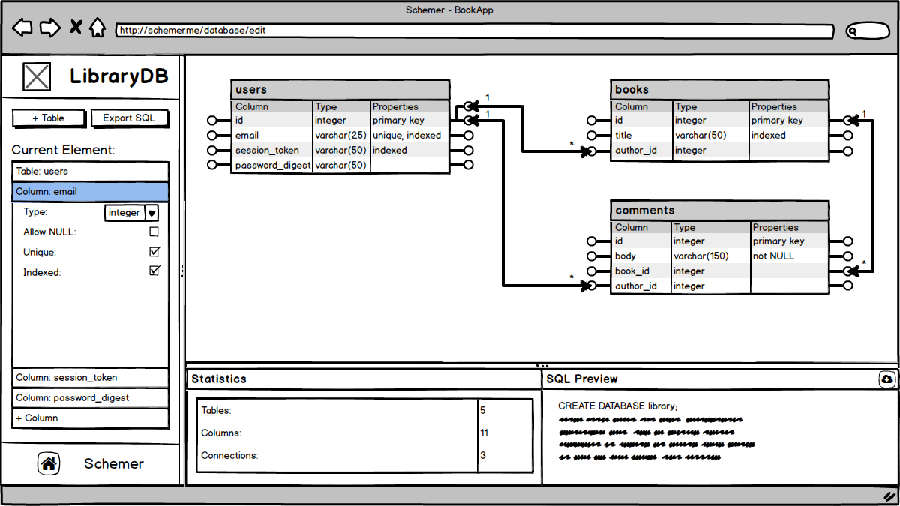
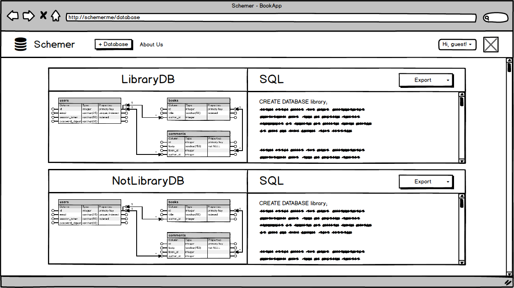

# Schemer Dev Readme / Project Proposal
## Background and Overview
Constructing a SQL database requires both an intimate knowledge of the SQL domain specific language and a pre-planned Schema.

Schemer is a database design tool that allows for database design and generation on the fly. The visual interface is interactive, and lets you setup tables, one-to-many and many-to-many relationships by simply dragging and dropping within the Schemer editor. The end result is a complete SQL query that the user can download and execute to create their database.

Schemer is built with a Vue frontend, an Node/Express backend, and MongoDB. (Dubbed by us as the **VENM** stack)

## Functionality and MVP
Schemer will, at minimum, be able to:
- [ ] Interactively create and edit tables in database
- [ ] Interactively create columns inside tables, be able to set data type and not NULL / unique / indexed attributes
- [ ] Setup one-to-many and many-to-many relationships between tables
- [ ] Dynamically parse graphical schema and generate SQL code.
- [ ] Autosave schema, render a 'user' page with a list of databases

In addition, Schemer will include
- [ ] A production README
- [ ] Secure Authentication (likely as an external package)

**Bonus Features**
- [ ] Generate SQL for editing a database, e.g. inserting / removing columns in the same interactive way
- [ ] Have an option to generate and ActiveRecord migration instead of raw SQL

## Technologies and Technical Challenges
**Backend: Node.js/Express [very tentative]**

**Frontend: Vue, JointJS**

#### [Wireframes and Single Page App structure go here]

#### Frontend integration
On the frontend, Vue is integrated with JointJS, an open-source diagramming library developed by [Client.io](ttps://www.jointjs.com/opensource). We use the JointJS equivalent of canvas as its own component, and Vue for all other views. Using the JointJS API, we export the schema state as JSON to be processed on the backend

#### Parsing JSON schema into SQL

[Sample JSON](docs/Sample_JSON.rb)

[Sample Logic](docs/Sample_parse_logic.rb)

#### Schemer Vues and Wireframes
**Database Editor Page:**

**Database Index Page:**

## Accomplished over the Weekend
* Worked through several Vue tutorials
* Read through JointJS documentation, generated some simple diagrams
* Generated a 'proof of concept' [demo](https://schemer.herokuapp.com/#/home), which demonstrates:
  * Successful integration of Vue and JointJS by allowing Vue components to control the state of JointJS elements
  * Successful conversion of graphical schema into JSON using the JointJS API
* Hosted the frontend structure (Vue + Webpack) on Heroku: [Live Link](https://schemer.herokuapp.com)

## Group Members & Work Breakdown
**Nikita Shalimov, Brady Kimball, Chris Cankov**

#### Day 1

* Reach consensus on team workflow - git, project file structure, meetings, coach check-ins (GROUP)
  * The project is broken into 3 main silos: JointJS modeling, interaction with Vue, and backend processing/data storage
  * Propose a daily (or 2 day) rotation of roles so each person works with all parts of the stack
* JointJS template for tables (CHRIS)
* Vuex tutorials and integration into demo (NIKITA)
* Finalize backend decision (GROUP)
  * Find tutorial and put together RESTful API example (BRADY)

#### Day 2

* JointJS template for columns (TBD)
  * Add/delete columns and column attributes
* Work on interaction between JointJS models and Vue panel components (TBD)
  * Aim to finish basic table interactions
  * Store data using Vuex store
* Store and serve serialized JointJS graphical schema on the backend (TBD)

#### Day 3

* Begin exploring JointJS linkages for relational associations (TBD)
* Complete interaction between JointJS models and Vue panel components (TBD)
  * Add/delete columns and edit their attributes
  * Store data in Vuex store
* Plan backend processor architecture (GROUP)
  * Use JointJS table template from Day 1 to generate basic SQL code (TBD)

#### Day 4

* Continue working on JointJS links and storing foreign key associations in JointJS model
* Leverage the backend functionality from Day 2 to implement auto-saving of database model
  * Bonus: Implement SQL preview using backend processor output
* Add columns + attributes to SQL processor from Day 2 JointJS template (TBD)

#### Day 5

* Start implementing a user state in the Vuex store and user page (TBD)
* Finish work on SQL preview in the db editor, stats on the current model, and export SQL to user (TBD)
* Implement user authentication and user model on backend (TBD)
  * Look into OAuth

#### Day 6

* Create splash page and focus on general UX (TBD)
* UX design on db editor page (TBD)
* Finalize backend SQL processor and serve user-specific databases (TBD)

#### Day 7

* Flex day
* Record a demo for the splash page (TBD)
* UX/style (TBD)
* Seeds
* Production README (GROUP)
